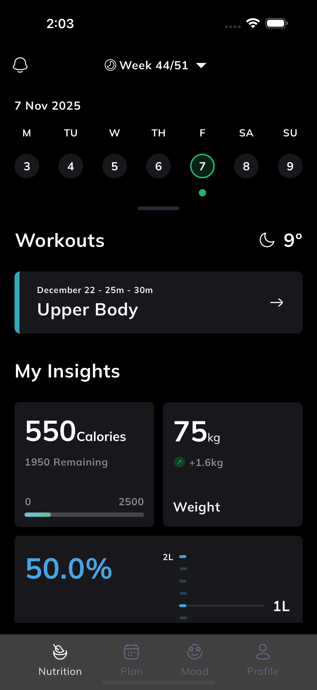
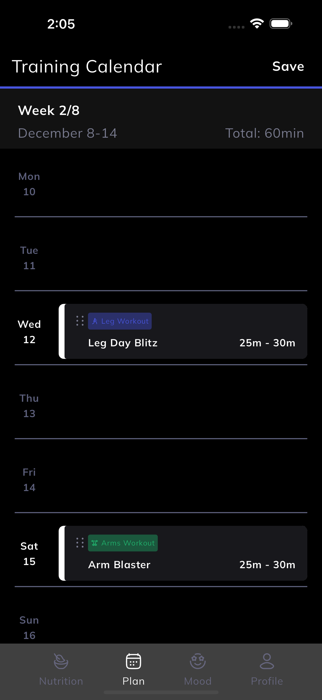
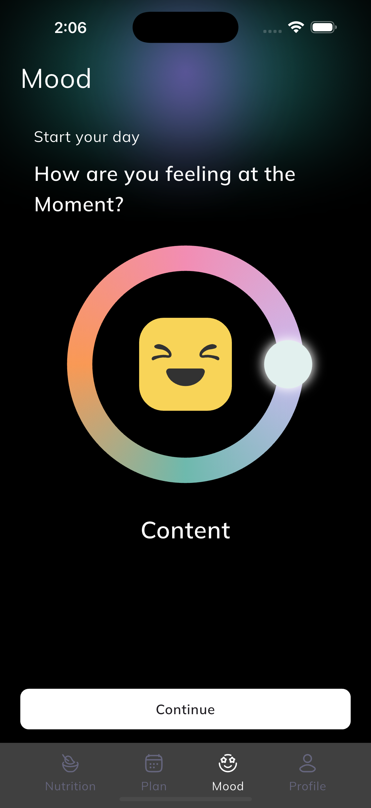

# test_evencir

The is the test for EvenCIR
---

## 🧩 Dependencies Used & Why

| Dependency                      | Purpose                                                                                  |
|---------------------------------|------------------------------------------------------------------------------------------|
| **get** (^4.7.2)                | Used for efficient and reactive state management throughout the app.                     |
| **flutter_screenutil** (^5.9.3) | Ensures responsive design that adapts perfectly to various screen sizes and resolutions. |
| **flutter_svg** (^2.2.2)        | Used to render high-quality SVG icons and illustrations.                                 |
| **table_calendar** (^3.2.0)     | Used to display and manage calendar views in the app.                                    |
| **intl** (^0.20.2)              | Used for formatting and filtering `DateTime` for better readability and localization.    |

---

## 📁 Project Structure

lib/
├── models/              # Contains data models and JSON parsing logic
├── screen/              # All UI screens and widgets
├── controllers/         # Handles business logic and state management
├── utils/               # Helper functions and app-wide constants
├── route_management/    # Manages app routing and navigation
├── widgets/             # Custom reusable widgets used across the app
└── main.dart            # Entry point of the application

---

## 📱 App Screenshots

| Nutrition Screen                                | Plan Screen                           | Mood Screen                           |
|-------------------------------------------------|---------------------------------------|---------------------------------------|
|  |  |  |

> 🖼️ Screenshots are captured on **iPhone 16 Pro Max Simulator** for best visual representation.

---

## 🎥 Demo Video

A complete walkthrough of the app’s features and UI is available here:  
👉 [View Demo Video on Google Drive](https://drive.google.com/file/d/1OnuXmXdhvb-5euU7HI34Q-n39pOfpzaT/view?usp=sharing)

---

## 📦 Download APK

You can directly install and test the app by downloading the latest APK:  
📲 [Download APK from Google Drive](https://drive.google.com/file/d/1n3UEqUmxIIttmjYI-580qJnlODizUmMR/view?usp=sharing)

---

## 🚀 Getting Started

To run this project locally:

#### bash
# Clone the repository
git clone https://github.com/Suzefa/test_evencir.git

# Get all dependencies
flutter pub get

# Run the app
flutter run

   

<b>Crafted with ❤️ using Flutter</b> 
<i>"Turning ideas into interactive experiences."</i>

